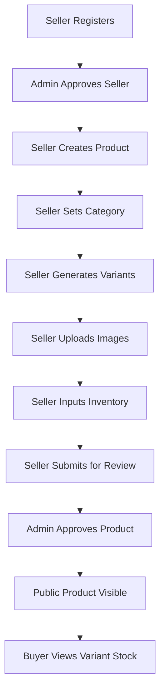

# Kashora Marketplace - Integration & Quality Report

Kashora is a high-performance Meesho-like marketplace built using Django, Django REST Framework, PostgreSQL, and React TypeScript.

---

## 1. System Integration Flow

The complete transactional pipeline is fully integrated and validated:

* **Product Visibility Rules:** A product becomes visible on the public store catalog ONLY when `product.status == "ACTIVE"`, `product.approval_status == "APPROVED"`, `seller.status == "APPROVED"`, and the selected variant has `is_active == True`.

---

## 2. Security & Boundaries

We enforce strict role-based separation:
* **Buyer Isolation:** Buyers can only perform read actions on the public categories and products. Accessing any `/api/v1/seller/` or `/api/v1/admin/` endpoints throws a `403 Forbidden` response.
* **Seller Isolation:** Sellers can read, edit, or delete ONLY their own products, variants, and image models. Attempting to access another seller's resource throws a `404 Not Found` response.
* **Admin Review:** Sellers can submit products for review but cannot self-approve. Approval permissions are strictly limited to `ADMIN` and `SUPER_ADMIN` users.
* **Inventory Constraints:** Available quantity updates must be positive values. Stock adjustments are guarded by database locks (`select_for_update`) to prevent race conditions and overselling.

---

## 3. Database Architecture

* **Category:** Self-referencing parent structure with a hierarchy protection validation preventing circular routing or self-parenting.
* **Product:** Holds branding, base values, and parameters. Includes indexes on `slug`, `status`, and `approval_status`.
* **ProductVariant:** Globally unique SKU constraints with variant attribute mappings.
* **ProductImage:** One primary flag constraint per product. Features automated primary reassignment upon deletions.
* **Inventory:** Associated with `ProductVariant`. Available quantity cannot drop below zero.
* **InventoryTransaction:** Audits all transactional inventory modifications with change notes.

---

## 4. API Endpoints

### Public Catalog
* `GET /api/v1/categories/` - Lists all active categories.
* `GET /api/v1/categories/{slug}/` - Gets details for an active category.
* `GET /api/v1/products/` - Paginated products listing with search and sorting filters.
* `GET /api/v1/products/{slug}/` - Fetch public product details with active variants and images.

### Seller Panel
* `GET/POST/PATCH/DELETE /api/v1/seller/products/`
* `POST /api/v1/seller/products/{id}/submit/`
* `GET/POST/PATCH/DELETE /api/v1/seller/products/{id}/attributes/`
* `GET/POST/PATCH/DELETE /api/v1/seller/products/{id}/variants/`
* `GET/POST/PATCH/DELETE /api/v1/seller/products/{id}/images/`
* `GET/PATCH /api/v1/seller/inventory/`
* `POST /api/v1/seller/inventory/{id}/add-stock/`
* `POST /api/v1/seller/inventory/{id}/adjust/`

### Admin Review Panel
* `GET /api/v1/admin/products/`
* `GET /api/v1/admin/products/pending/`
* `POST /api/v1/admin/products/{id}/approve/`
* `POST /api/v1/admin/products/{id}/reject/`

---

## 5. Frontend Navigation Layout

The React frontend has been built and compiled successfully with React 18, React Router v6, and TypeScript:
* `/products` - Browse the public store. Search by brand, select categories, and sort by price.
* `/products/:slug` - Product landing detail view featuring active size choices, stock summaries, and shipping terms.
* `/categories/:slug` - Direct redirect filter mapping to `/products?category={slug}`.
* `/seller/inventory` - Seller stock manager.
* `/seller/inventory/:id` - Detailed stock audit trail list.
